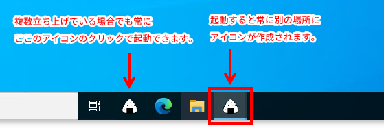
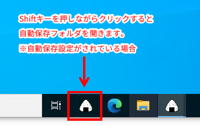

# Raptureを起動するだけ

## 概要

実行すると同じフォルダにあるrapture.exeを起動して終了します。[rapture](https://www.vector.co.jp/soft/win95/art/se386376.html)を使用していない人には何の役にも立ちません。  

* rapture.exeを起動したら、本ソフトウェア自身はすぐに終了します。そのため、タスクバーにピン留めをして使用した場合、実行後にタスクバーのアイコンがアクティブになることがありません。常にタスクバーのアイコンの左クリックから実行できます。  
     

* Shiftキーを押しながら実行するとraptureの自動保存フォルダを開きます。  
     

**※本ソフトウェアは[rapture](https://www.vector.co.jp/soft/win95/art/se386376.html)およびその作者様とは一切関係ありません。**

## インストール

rapture.exeと同じフォルダに`raptureを起動するだけ.exe`を入れるだけです。実行すると同じフォルダにあるrapture.exeを起動して終了します。  

**補足**  
タスクバーにピン留めをして使用する場合は、そのままではアイコンがありませんので、見栄えが悪くなります。必要に応じて以下を実施してください（しなくても使用できます）。  

1. `raptureを起動するだけセットアップ.vbs`を`rapture.exe`及び`raptureを起動するだけ.exe`と同じフォルダに入れます。  

2. `raptureを起動するだけセットアップ.vbs`を実行します。  

3. 同じフォルダ内に`raptureを起動するだけ.exe`へのショートカット`rapture.lnk`（アイコンは`rapture.exe`と同じ）が作成されます。  

4. ショートカットをタスクバーにドラッグ＆ドロップするとタスクバーにピン留めします。  

ショートカットが作成された後は`raptureを起動するだけセットアップ.vbs`は不要です。削除して問題ありません。

## アンインストール

`raptureを起動するだけ.exe`を削除します。  

タスクバーにピン留めしている場合はタスクバーからピン留めを外します。またショートカットを作成している場合はショートカットも削除します。  

## 動作確認環境
Microsoft Windows10 x64

## ライセンス等

This software is released under the MIT License.   
詳細については、[LICENSE](./LICENSE) ファイルを参照してください。
